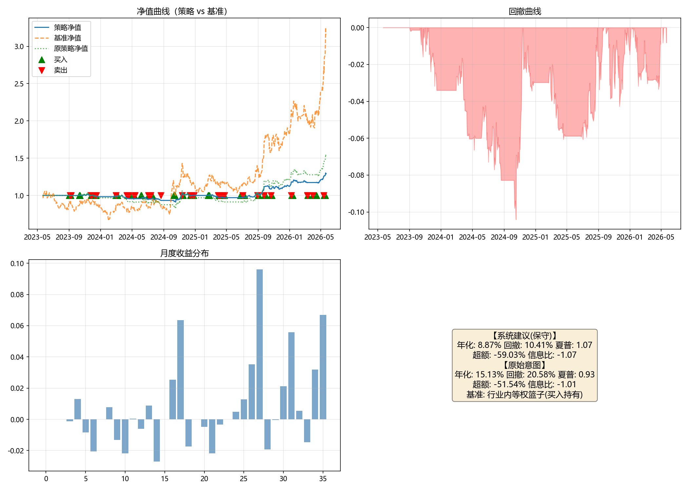

# 投资想法分析报告

## 一、原始想法
> 半导体设备板块（北方华创、中微公司、拓荆科技、华海清科），股价突破 60 日年线后等权买入持有，跌破 60 日线卖出；季度调仓，单票仓位不超过 15%。

**投资类型**：事件驱动
**核心逻辑**：半导体设备四股按60日线突破买入、跌破卖出，季度调仓

## 二、逻辑链梳理

### 你的投资逻辑
[前提层] → [行业层] → [个股层]

### 逻辑链分析

| 层级 | 命题 | 证据 | 缺口 | 替代解释 |
|------|------|------|------|----------|
| 前提 | P1：半导体设备板块个股价格存在趋势延续性，突破60日年线后正收益概率显著高于随机水平 | 无（B1 “前提→行业”证据为空） | 60日年线定义未确认（60日均线/250日年线/两者同时）；突破/跌破确认方式未确认；无历史回测结果验证正收益概率；未指定回测区间、比较基准和样本外验证 | 个股趋势可能来自公司特定信息或个别股票资金行为，未必能加总为行业指数趋势 |
| 行业 | I1：半导体设备行业指数具有可交易的趋势特征；I2：四只标的流动性足够支持等权买入、季度调仓和跌破卖出 | 公开行业分类通常将北方华创、中微公司、拓荆科技、华海清科归入半导体设备行业 | 未验证四只个股与行业指数的历史相关性和跟踪误差；未提供日均成交额、换手率、买卖价差数据；交易成本、滑点、冲击成本假设缺失；初始资金及剩余资金处理未说明；季度调仓与跌破卖出并存时的再平衡规则不明确 | 行业指数趋势可能由板块内其他成分股或市场整体beta驱动，与四只标的的等权组合趋势不完全一致；流动性充足只能保证可交易，不能保证信号收益在扣除成本后仍为正 |
| 个股 | S1：北方华创、中微公司、拓荆科技、华海清科是半导体设备板块核心代表标的，具备足够的流动性和可交易性 | 同行业分类证据（四只标的归属半导体设备行业） | 未验证四只个股与行业指数的相关性和跟踪误差；未提供具体流动性数据（日均成交额、换手率、买卖价差）；未说明停牌、涨跌停或流动性缺失时的交易处理规则；分红送转、复权方式影响未说明 | 四只个股基本面、beta和流通盘差异较大，等权组合未必能复制行业指数趋势；策略收益可能来自市场整体动量或行业景气周期，而非突破/跌破规则本身 |

## 三、多维度分析

### 逻辑自洽性
基于 B1 的 analysis.chain 逐环展示：

**环节1：前提→行业**
- **claim**：若半导体设备板块个股价格存在趋势延续性，且突破60日年线后正收益概率显著高于随机水平，则半导体设备行业指数同样具有可交易的趋势特征。
- **transmission**：四只标的作为半导体设备行业核心个股，其价格若在突破信号后呈现正收益概率优势，表明个股价格存在动量或趋势自相关；当多只核心成分股趋势方向一致时，它们的价格变化会共同推升或拉低行业指数，使行业指数表现出可交易的趋势特征。
- **evidence**：无。
- **gap**：60日年线定义未确认；突破/跌破确认方式未确认；当前未提供任何历史回测结果；未指定回测区间、比较基准和样本外验证区间。
- **alternative_explanation**：个股层面的趋势延续可能来自公司特定信息或个别股票的资金行为，未必能加总为行业指数趋势；行业指数趋势可能由半导体设备板块内其他成分股或市场整体beta驱动，与四只标的的等权组合趋势不完全一致。

**环节2：行业→个股**
- **claim**：半导体设备行业指数的可交易趋势特征，与四只标的的行业归属、核心代表性及流动性结合，使其适合作为突破买入、跌破卖出、季度调仓的执行载体。
- **transmission**：行业趋势特征通过成分股价格相关性传导至四只标的：若行业指数具有趋势延续性，四只核心标的作为行业代表，其价格大概率与行业指数同步，等权持有可近似表达行业暴露。流动性充分可降低等权建仓、季度调仓和跌破卖出的冲击成本，使规则可执行。
- **evidence**：公开行业分类：申万/中信行业分类通常将北方华创、中微公司、拓荆科技、华海清科归入半导体设备行业。
- **gap**：未验证四只个股与半导体设备行业指数的历史相关性和跟踪误差；未提供四只股票的日均成交额、换手率和买卖价差数据；未说明初始资金规模、单票15%上限下剩余资金处理方式；未给出交易成本、滑点、冲击成本假设；未说明复权方式及分红送转对信号计算和持仓成本的影响；未说明停牌、涨跌停或流动性缺失时的处理规则；季度调仓与跌破卖出并存时，再平衡时点、现金处理及是否恢复等权不明确。
- **alternative_explanation**：四只股票虽同属半导体设备行业，但个股基本面、beta和流通盘差异较大，等权组合未必能复制行业指数趋势；流动性充足只能保证可交易，不能保证突破信号在扣除交易成本和冲击成本后仍具有正期望；策略收益可能来自市场整体动量或行业景气周期，而非该具体突破/跌破规则。

### 时机
基于 B2 的 analysis：
- **市场状态**：无联网证据，无法核实当前半导体设备板块及四只标的是否已突破或跌破60日年线、趋势方向、市场情绪状态。需要实时价格与均线关系才能刻画当前时点状态；从策略规则看，属于顺势突破型时机框架，核心是等待价格对60日年线的有效突破。
- **估值背景**：无联网证据，无法核实四只标的及半导体设备板块当前PE/PB分位、相对历史位置和行业横向估值水平。需外部数据补充。
- **催化剂**：无（catalysts 为空）。
- **有利条件**：
  - 四只标的或板块指数出现放量突破用户定义的60日年线信号，且突破得到连续收盘价确认，避免单日假突破。
  - 板块层面出现明确且时间窗可核实的催化剂（如主要晶圆厂资本开支上修、国产设备招标/中标、行业政策支持、龙头财报超预期等），并伴随成交量放大。
  - 市场情绪从震荡或防御状态转向科技成长占优，半导体设备板块相对大盘出现持续相对强势。
  - 在季度调仓框架下，季度初出现突破信号且突破后回踩不破均线，比季度末追高更有利于时机。
- **不利条件**：
  - 四只标的或板块指数接近或已跌破60日线支撑，趋势信号转空，突破型策略的退出条件被触发。
  - 出现跳空低开、放量长上影、突破后快速回落等假突破特征，时机质量下降。
  - 半导体设备板块估值已处于历史高位且缺乏增量催化，即使突破信号出现，回撤风险加大。
  - 宏观流动性收紧、全球半导体资本开支下修、出口管制升级等偏空事件，使板块趋势恶化。
  - 用户未明确60日年线定义及突破/跌破确认方式，信号无法唯一确定，时机的可操作性受限。
  - 输入未提供任何明确催化剂，当前时机中性；季度调仓规则可能使入场或退出滞后于行情转折。
- **信息缺口**：1）用户未给持有周期，仅给出季度调仓，无法判断时机条件应匹配多长周期；2）未提供当前行情、估值、资金动向等实时事实，且本维度无联网证据；3）60日年线定义、突破/跌破确认方式、复权方式未明确，直接影响时点判断；4）未提供季度调仓的具体日期，季度窗口对时机的敏感性无法精确评估。

### 估值
基于 B3 的 analysis：
- **当前估值数字与口径**：
  - 北方华创：PE-2026E 为 46.5倍（来源：爱建证券2026-04-23报告，2026年归母净利润74.6亿元对应当前市值）。2027E/2028E PE 分别为35.1/27.6倍。
  - 拓荆科技：PE-TTM 当前点值未明确，仅知其近3年分位16.4%。
  - 中微公司、华海清科：当前PE/PB无联网可核实数值。
- **历史分位**：
  - 拓荆科技：PE-TTM 近3年分位约16.4%（来源：亿牛网，数据区间约2023-2026）。
  - 北方华创：亿牛网仅提供年度PE区间，2026年平均58.5倍、最高87.7倍、最低48.88倍，未给出当前分位。
  - 中微公司、华海清科：无分位证据，需基本面数据层计算。
- **行业相对偏离**：半导体设备行业PE均值及四股相对行业偏离的具体数字未获得可核实来源，无法给出“低于行业X%”的统计。
- **绑定 thesis 的便宜/贵阈值**：
  - **便宜阈值**：对“60日线突破后跟随”逻辑而言，突破发生时个股PE-TTM近3年分位<30%可视为便宜区（拓荆科技当前分位16.4%落在该区间，但该分位能否持续至实际突破日未验证）。理由：低估值分位下，即使趋势反转，估值压缩空间相对有限，突破信号的盈亏比更有利。
  - **贵阈值**：突破发生时个股PE-TTM近3年分位>70%可视为贵区。理由：趋势突破叠加高估值分位，一旦价格趋势破坏，估值与价格可能双杀，突破策略的尾部风险显著上升，期望收益会被压缩。

### 风险收益比
基于 B4 的 analysis：
- **上行情景**：
  - 场景1：半导体设备行业进入新一轮晶圆厂资本开支上行周期，国产替代加速，四只核心设备商获得订单与盈利上修，趋势行情延续。幅度约 +30%~+80%。触发：国内晶圆厂资本开支指引上修、设备招标/中标密集公告、出口管制缓和、板块指数放量站稳趋势线上方。
  - 场景2：AI、先进制程或存储扩产带来新增设备需求，盈利预期上修，出现估值与业绩双击。幅度约 +50%~+120%。触发：先进制程扩产落地、大额订单公告、季度业绩超预期、地缘限制边际改善。
- **下行情景**：
  - 场景1：突破后快速回落形成假突破，按规则跌破60日线卖出，承担一次趋势信号失败损失。幅度约 -3%~-10%。触发：突破后量能不足、板块快速回落、收盘价跌破用户定义的60日线/确认线。
  - 场景2：行业景气下行或地缘风险升级导致趋势反转，股价在止损后继续深跌；若持有期间出现跳空或流动性缺失，实际亏损可能超过理论止损。幅度约 -20%~-40%。触发：下游资本开支大幅下修、美国出口管制升级、季度业绩不及预期、市场风格从成长切向防御。
- **不对称性**：该策略带有60日线止损，单笔下行有纪律约束，但趋势策略的盈亏分布通常表现为多次小亏与少数大赚的组合；上行在趋势行情中具备较大板块弹性，下行在震荡市中可能因反复假突破形成累积损耗。非对称性取决于趋势行情与震荡行情的时间占比、跳空风险以及止损执行效率，不能仅凭单笔固定止损判断收益大于风险。
- **关键风险驱动**：
  - 半导体设备行业周期/下游资本开支（重大）：信号为国内晶圆厂资本开支指引、设备招标与中标数据、月度出货。
  - 地缘政治/出口管制升级（致命）：信号为美国BIS出口规则变化、实体清单更新、关键零部件供应受限。
  - 估值与盈利不匹配、板块高波动（重大）：信号为板块PE/PB历史分位、盈利增速与股价背离、业绩发布后波动放大。
  - 趋势信号失效/震荡市反复假突破（重大）：信号为突破后回落频率、均线缠绕、策略回测最大回撤与胜率。
  - 个股流动性/交易执行风险（可控）：信号为日均成交额、买卖价差、涨跌停、停牌。
- **信息缺口**：用户风险偏好、资金规模与单票15%上限外的剩余资金处理未知；60日均线/年线具体定义、突破与跌破确认方式、交易成本与复权方式、季度调仓日、停牌/涨跌停处理、策略回测区间等缺失，影响实际风险收益测算。

### 替代选择
基于 B5 的 analysis：
- **可比标的对比**：
  - **盛美上海**：清洗设备、电镀设备、炉管、先进封装湿法设备；中大型，流动性好；在清洗/炉管环节与北方华创部分重叠，不覆盖刻蚀、PECVD/ALD、CMP。
  - **芯源微**：涂胶显影、物理清洗、先进封装设备；中型，流动性适中；与四股产品线基本不重叠，属光刻配套/封装环节。
  - **中科飞测**：检测/量测设备；中型，流动性适中；与四股产品线基本不重叠，属检测量测环节。
  - **微导纳米**：ALD薄膜沉积设备；中小型，流动性弱于目标组合多数标的；与拓荆科技在ALD环节部分重叠，属薄膜沉积细分竞争者。
  - **半导体设备ETF/指数**：板块打包，覆盖多环节设备公司；流动性通常较好；分散度更高，无法复现四股等权/单票15%规则。
- **目标组合独特性与可替代性**：目标组合覆盖前道设备中刻蚀、薄膜沉积、CMP、炉管/清洗等核心环节：北方华创为平台型设备公司，覆盖环节较广；中微公司在刻蚀设备具有较强地位；拓荆科技在PECVD/ALD薄膜沉积为国产核心标的；华海清科在CMP设备环节具备稀缺性。组合内部在环节上互补。同赛道其他标的可在单一环节或板块打包层面形成替代，但覆盖环节与暴露结构与目标组合不同。

## 四、综合研判

**被证据支撑的方面**：
- 行业归属与核心代表性：B1 在“行业→个股”环节列示公开行业分类，通常将北方华创、中微公司、拓荆科技、华海清科归入半导体设备行业；B5 进一步说明目标组合覆盖刻蚀、薄膜沉积、CMP、炉管/清洗等前道核心环节，组合内部环节互补。
- 估值可核实的局部事实：北方华创2026E PE为46.5倍（来源：爱建证券）；拓荆科技PE-TTM近3年分位约16.4%（来源：亿牛网），按 <30% 便宜阈值，拓荆科技处于便宜区间，但该分位能否持续至实际突破日未验证。
- 策略规则本身设定了单笔下行风控：B4 指出该策略带有60日线止损，单笔下行有纪律约束；上行在趋势行情中具备半导体设备板块历史高beta弹性，下行在震荡市可能通过反复假突破产生累积损耗，但止损规则在框架上可确认。
- 目标组合并非完全可替代：B5 比较盛美上海、芯源微、中科飞测、微导纳米及半导体设备ETF后，指出同赛道其他标的仅在单一环节或板块打包层面形成部分替代，目标组合在核心环节覆盖较完整，暴露结构不同。

**薄弱方面**：
- 核心趋势假设未验证：B1 明确“突破后正收益概率显著高于随机水平”缺乏任何历史回测证据，且60日年线定义、突破/跌破确认方式、复权方式均未确认，无法判断信号是否具有正期望。
- 行业→个股传导为未验证链接：未验证四只个股与半导体设备行业指数的历史相关性和跟踪误差；等权组合不等于行业指数，个股差异较大，行业指数趋势可能由其他成分股或市场beta驱动。
- 交易执行与成本数据严重缺失：未提供日均成交额、换手率、买卖价差、交易成本、滑点、冲击成本，未说明初始资金、剩余资金处理、季度调仓再平衡、停牌/涨跌停处理、分红送转影响。
- 时机维度信息不足：无联网证据，无法核实当前是否突破或跌破60日年线、趋势方向、市场情绪及板块相对强弱；catalysts为空。
- 估值完全性不足：中微公司、华海清科当前PE/PB无联网可核实数值；北方华创仅有2026E forward PE；行业相对估值未覆盖；PE可能失真，PS或EV/Sales未补充。
- 存在致命及重大风险驱动：地缘政治/出口管制升级列为致命，可能造成跳空、实际亏损超过理论止损；行业周期、估值与盈利不匹配、趋势信号失效列为重大。
- 替代对比量化数据空缺：未提供目标四股及可比标的的实时市值、日均成交额、指数成分权重等量化数据。

**关键不确定性**：
- 突破60日年线后正收益概率是否显著高于随机水平，在四只半导体设备股上是否成立，且扣除交易成本后仍保持正期望。
- 四只个股与半导体设备行业指数是否足够同步，等权组合能否有效表达行业趋势而非偏离为个股alpha组合。
- 当前时点是否处于有效突破、市场情绪是否已转向科技成长占优，以及是否存在明确催化剂驱动趋势延续。
- 突破时四股的估值风险水平：中微公司、华海清科当前PE/PB、北方华创PE-TTM分位，以及行业相对估值偏移是否落在便宜/危险区域。
- 出口管制/地缘政治会否升级并导致跳空下跌，使60日线止损无法按理论执行、实际亏损扩大。
- 在60日年线定义、突破/跌破确认、复权方式、季度调仓日等具体规则未定时，信号是否具有唯一可操作定义。

**成立条件**：若未来可核实的历史回测显示：在明确定义60日年线为60日均线/250日年线或两者同时、以收盘价连续N日确认突破/跌破、采用一致复权口径并覆盖至少一个半导体设备上行与下行周期后，四股等权组合的突破买入/跌破卖出策略，扣除交易成本、滑点和冲击成本后，相对中证半导体设备指数或买入持有基准存在稳定正超额；同时四只个股近3年与行业指数收益相关性较高、跟踪误差有限，且流动性足以支持15%仓位和季度调仓，则核心逻辑成立。

**证伪条件**：若出现以下任一可观测事实则thesis被推翻：1）美国BIS出口管制升级、实体清单更新或关键零部件供应受限，板块出现连续跳空低开且跌破60日线后无法按规则有效止损，实际亏损显著超过理论止损；2）回测显示该突破/跌破规则相对板块指数或买入持有基准无正超额，或正超额完全可由市场整体动量/行业景气周期解释，扣除成本后不具正期望；3）四只个股与行业指数相关性低、跟踪误差大，等权组合无法有效表达板块趋势，且实盘冲击成本使规则失效。

## 五、关键风险

基于 B4 的 key_risk_drivers 逐项列出：

| 风险因子 | 观测信号 | 严重度 |
|----------|----------|--------|
| 半导体设备行业周期/下游资本开支 | 国内晶圆厂资本开支指引、设备招标与中标数据、月度出货 | 重大 |
| 地缘政治/出口管制升级 | 美国BIS出口规则变化、实体清单更新、关键零部件供应受限 | 致命 |
| 估值与盈利不匹配、板块高波动 | 板块PE/PB历史分位、盈利增速与股价背离、业绩发布后波动放大 | 重大 |
| 趋势信号失效/震荡市反复假突破 | 突破后回落频率、均线缠绕、策略回测最大回撤与胜率 | 重大 |
| 个股流动性/交易执行风险 | 日均成交额、买卖价差、涨跌停、停牌 | 可控 |

## 六、参考回测（基于网络经验默认值）

> ⚠️ **回测性质重要说明**：
> - 本章回测结果基于网络检索 / 静态默认补全的行业经验参数，**仅供参考，不构成对想法的验证或否认**。
> - 回测通过 ≠ 想法成立：历史区间表现好，不代表未来有效；样本区间与起止点选择会显著影响结果。
> - 存在过拟合与幸存者偏差风险：参数由默认补全而非针对本想法定制；成分股为当前上市池，未包含已退市个股。
> - 策略相对收益须结合基准解读，单看绝对收益无法区分「策略 alpha」与「市场 beta」。
> - **板块级回测基准机制**：无单一指数对标时，采用 Skill D 指定的 3–5 只代表性个股等权构建篮子作为回测组合与基准参照——若 `data/index_clean.csv` 含匹配的真实指数则以真实指数为基准，否则以上述等权篮子（买入持有）为基准。该篮子为**代表性样本而非全行业成分股**，存在代表偏差，仅近似反映板块走势，不代表板块全部个股表现。

### 策略参数

| 参数 | 取值 | 来源 | 理由 |
|------|------|------|------|
| 标的 | 北方华创、中微公司、拓荆科技、华海清科等权组合 | user | 用户明确提到四只标的的等权组合 |
| 买入条件 | 四股等权组合净值收盘价上穿60日均线 | assumption | 用户原始想法为突破60日年线买入，但60日年线定义存在歧义；为落地为价格可计算指标，取60日均线作为默认趋势均线，采用组合净值以避免个股信号不一致 |
| 卖出条件 | 四股等权组合净值收盘价跌破60日均线 | assumption | 与买入信号对称，落地为60日均线 |
| 持有周期 | 季度调仓，最长4期（约1年） | user | 用户指定季度调仓；最长4期采用系统默认中期策略默认值 |
| 仓位上限 | 7.5%（单票，保守模式调整后） | user | 用户明示单票仓位上限15%，保守模式因致命风险触发，仓位减半至7.5% |
| 止损 | -10% | assumption | 用户未明示止损，采用系统默认 -15%，因保守模式触发收紧至 -10%；止盈 +20% 保持不变 |

**参数来源说明**：
- `user`：用户明确指定
- `web_experience`：联网检索的行业经验（附出处链接）
- `assumption`：模型静态默认值

**网络经验来源**：无（本次所有参数中无 `web_experience` 来源，均为用户或模型假设）

**回测窗口**：2023-05-22 至 2026-05-22
- 对齐方式：holding_period
- 说明：想法为长期趋势择时型（基于均线突破/跌破，持有周期为季度级），禁止使用 catalyst。持有周期为季度调仓，在近3年窗口内滚动多段季度子窗口，整体窗口锚定行情数据最新交易日 DATA_LATEST_DATE=2026-05-22。

**静默保守模式**：已开启。触发原因：1) B4 关键风险驱动中“地缘政治/出口管制升级”severity=致命；2) B1 前提→行业环节核心传导未验证（突破后正收益概率无回测证据），存在关键未验证链接；3) C 的 weakest_aspects 包含致命风险相关项。并在你明示的 position.max_weight=15%（单票上限）基础上自动做保守调整 → 7.5%（自动化流程，未发起确认）；其余参数按保守规则调整（建仓批次从3批加至4批，止损从 -15% 收紧至 -10%）。

### 回测验证

**系统建议（保守模式回测）**：

| 指标 | 数值 |
|------|------|
| 回测区间 | 2023-05-22 至 2026-05-22 |
| 年化收益率 | 8.87% |
| 最大回撤 | 10.41% |
| 夏普比率 | 1.07 |
| 跑赢基准 | -59.03% |
| 基准期间涨跌幅 | 215.1% |
| 市场状态 | 上涨市 |

**原始意图（保守覆盖前参数回测）**：

| 指标 | 数值 |
|------|------|
| 回测区间 | 2023-05-22 至 2026-05-22（同保守版） |
| 年化收益率 | 15.13% |
| 最大回撤 | 20.58% |
| 夏普比率 | 0.93 |
| 跑赢基准 | -51.54% |
| 基准期间涨跌幅 | 215.1% |
| 市场状态 | 上涨市 |

> 说明：原始意图分支使用 D 的 `original_params`（保守覆盖前的参数，忠实还原用户本意/系统默认非保守值），信号与持有期与保守版一致，仅仓位与风控放开。两分支对比可区分「仓位/风控约束贡献」与「择时能力贡献」。**原始意图分支仅供对比参考，非投资建议。**

### 超额收益归因说明
- **仓位是否对齐**：保守版组合总仓位仅30%（单票7.5%×4），而基准为行业内等权篮子买入持有，本质是满仓运作。基准期间大幅上涨215.1%，保守版半仓约束导致只能获得部分涨幅，策略净值仅1.291 vs 基准3.151，跑输基准的主因是仓位差而非择时差。
- **双分支对比**：保守模式拖累 = 保守超额（-59.03%）− 原策略超额（-51.54%）= -7.49个百分点。原策略总仓位60%仍大幅跑输基准，说明即使放开仓位，策略也未能有效捕捉基准涨幅，但保守约束额外拖累了7.49个百分点。
- **是否踏空**：保守版交易次数135次，原始策略108次，交易频繁。在基准单边上涨市中，60日均线信号可能出现多次上穿/下穿反复，导致策略频繁进出，损失趋势收益，形成踏空。基准末期净值3.151远高于策略净值，印证了频繁交易在强趋势行情中的劣势。
- **基准性质**：基准为行业内等权篮子（买入持有），是代表性样本而非全行业成分股，存在代表偏差；且该篮子与策略组合成分相同，但基准满仓持有、无信号、无成本，而策略受仓位、择时和交易成本拖累，超额收益被机械放大。
- **单向市特征**：基准期间为显著上涨市（涨幅215.1%），策略受半仓约束和均线择时在强趋势行情下劣势明显，导致大幅跑输基准。

### 回测结果可视化

## 七、总结

### 逻辑是否成立
该投资想法的核心逻辑是：半导体设备四股在突破60日年线后买入、跌破60日线卖出，季度调仓，单票不超过15%。基于现有证据，该逻辑**尚未被证明成立**，也未被完全推翻。其成立依赖于历史回测证明信号具有正期望、四股与行业指数高度相关且流动性充分；而如果出现出口管制升级导致跳空止损失效、回测显示无正超额或个股与行业脱节，则逻辑被证伪。当前由于核心趋势假设未验证、交易规则定义不清、关键数据缺失，逻辑处于**证据不足、不可确认**的状态。

### 后续观察清单
- [ ] 明确60日年线具体定义（60日均线 / 250日年线 / 两者同时）及突破/跌破确认方式（盘中/收盘、连续天数、幅度阈值）
- [ ] 提供或获取历史回测结果，验证突破买入/跌破卖出策略在半导体设备板块的超额收益与胜率
- [ ] 获取四只个股与半导体设备行业指数的历史相关性、跟踪误差及流动性数据（日均成交额、换手率、买卖价差）
- [ ] 明确初始资金规模、单票15%上限下剩余资金处理方式及季度调仓再平衡细则（是否恢复等权、现金处理）
- [ ] 明确交易成本假设（佣金、滑点、冲击成本）与复权方式（前复权/后复权/不复权）及分红送转处理
- [ ] 核实中微公司、华海清科当前PE/PB及北方华创PE-TTM分位，补充行业相对估值数据
- [ ] 跟踪美国BIS出口规则变化、实体清单更新及关键零部件供应情况，防范致命风险
- [ ] 验证策略在震荡市中的表现，评估反复假突破带来的累积损耗
- [ ] 补充可比标的（盛美上海、芯源微、中科飞测、微导纳米）的实时市值与流动性数据，以评估替代或分散方案
- [ ] 确认季度调仓的具体日期安排，评估调仓时点对策略收益的影响

---

⚠️ **重要提示**：
1. 本报告由 AI 生成，分析内容基于公开信息和模型推理，不保证完整性和准确性。
2. 标注为 `web_experience` 的参数来自联网检索的行业经验，仅供参考，不构成投资建议。
3. 参考回测结果基于网络经验 / 静态默认参数，结果好坏不构成对想法的确认或否认；**回测通过不等于想法被验证**，存在过拟合、幸存者偏差与样本区间依赖风险。
4. 本报告不构成投资建议。