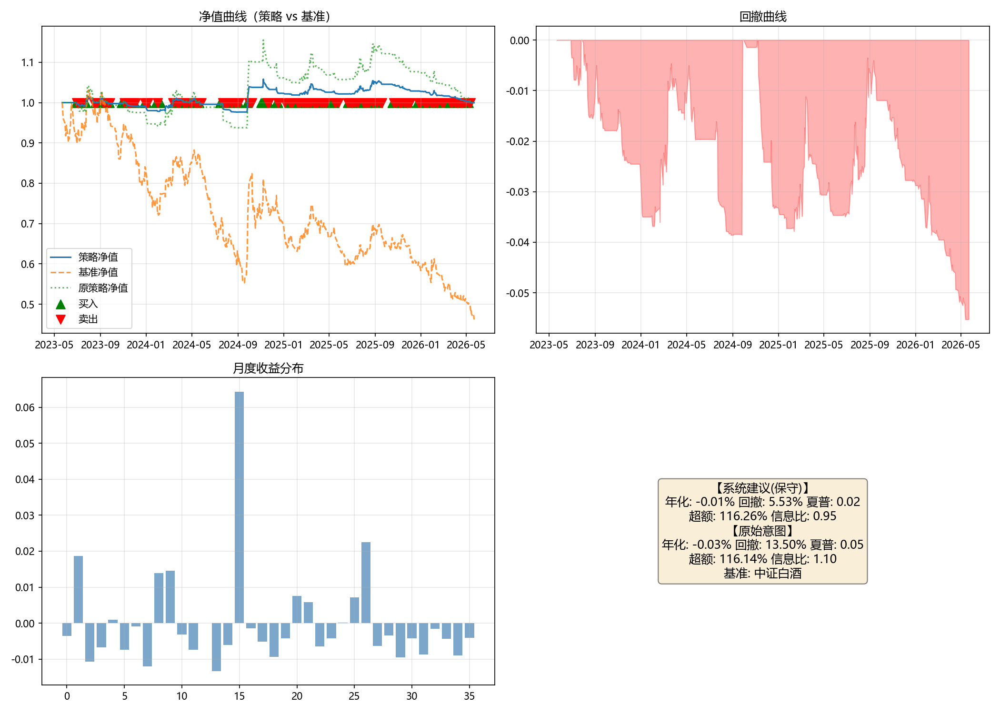

# 投资想法分析报告

## 一、原始想法
> 白酒龙头贵州茅台、五粮液、泸州老窖，站上 20 日均线就买、跌破就卖，满仓干。

**投资类型**：事件驱动  
**核心逻辑**：对白酒龙头股执行20日均线趋势跟踪策略，满仓交易。

## 二、逻辑链梳理

### 你的投资逻辑
[前提层：20日均线上下穿收益区分假设] → [行业层：三只股票属于申万白酒行业市值前三龙头] → [个股层：三只股票均可计算20日均线并执行交易]

### 逻辑链分析

| 层级 | 命题 | 证据 | 缺口 | 替代解释 |
|------|------|------|------|----------|
| 前提 | P1：贵州茅台、五粮液、泸州老窖股价在站上20日均线后的平均收益优于跌破后平均收益 | 无直接历史回测证据；仅有策略假设 | 核心命题未提供实际回测结果；均线计算方式（简单/指数、收盘/盘中）、回测区间、数据频率、收益口径未指定；满仓下资金分配、再平衡规则缺失 | 即使存在收益差异，可能来自市场动量、流动性特征或白酒板块整体趋势，而非白酒行业基本面属性；三只龙头可能因机构持仓和共同beta而表现趋同 |
| 行业 | I1：三只股票均属于申万白酒行业，且为市值排名前三的龙头公司 | 申万行业分类：三只股票均属于申万白酒行业成分股；市值排名：为白酒行业市值靠前的龙头公司（可查交易所市值数据） | 行业层仅确认行业分类，未给出行业利好或风险向个股收益传导的机制 | 行业属性可能并非均线策略有效的因果来源；三只龙头可能受共同机构持仓和市场beta影响 |
| 个股 | S1-S3：贵州茅台、五粮液、泸州老窖均为A股上市，具备完整日线历史行情数据，可计算20日均线 | 三只股票均为A股上市，可查询上交所/深交所行情数据；均有完整日线历史行情，可用于计算20日均线（Wind、同花顺等） | 个别股票的资金分配比例未指定；20日均线计算方式、交易成本与滑点、满仓再平衡规则未提供；泸州老窖一季报盈利数据未提取 | 个股可交易、可计算均线并不代表行业层因素对股价趋势具有解释力；个股表现可能受公司特定事件、估值、资金流影响，均线信号可能分化 |

## 三、多维度分析

### 逻辑自洽性
基于 B1 的 `analysis.chain` 内容，逐环展示：

**第一环：前提→行业**
- **主张**：用户策略假设三只白酒龙头股在股价站上20日均线后的平均收益优于跌破20日均线后的平均收益；该假设被放入申万白酒行业市值前三龙头的行业框架下。
- **传导机制**：前提层P1假设三只个股的20日均线上穿/下穿信号具有收益区分能力；行业层I1将三只股票共同归类为申万白酒行业市值前三龙头。若P1成立，则这种均线信号收益区分可被视为三只白酒龙头组成的行业组内共同特征。
- **证据**：申万行业分类：三只股票均属于申万白酒行业成分股；市值排名：为白酒行业市值排名靠前的龙头公司。
- **缺口**：P1的核心命题尚未提供实际历史回测结果；未指定均线计算方式、回测区间、数据频率、收益计算口径；满仓下资金分配比例、再平衡规则缺失。
- **替代解释**：均线收益区分可能来自市场动量、流动性特征或白酒板块整体趋势，而非白酒行业基本面属性；三只龙头可能因机构持仓和共同beta而表现趋同。

**第二环：行业→个股**
- **主张**：三只白酒龙头标的作为策略执行对象，均在A股上市且具备完整日线历史行情数据，可计算20日均线并执行交易规则。
- **传导机制**：行业层I1确认三只股票均为白酒行业龙头；个股层S1、S2、S3进一步确认均在A股上市、具备完整日线行情，因此从行业归属可传导至个股：20日均线可被计算，买卖条件在技术执行上具备可操作性。
- **证据**：三只股票均为A股上市股票，可查询行情数据；均有完整日线历史行情，可用于计算20日均线；均属于申万白酒行业。
- **缺口**：行业层仅确认分类，未给出行业利好/风险向个股收益传导的机制；资金分配比例未指定；交易成本与滑点、再平衡规则未提供。
- **替代解释**：个股可交易、可计算均线不代表行业层因素对股价趋势有解释力；个股受公司特定事件、估值、资金流影响，均线信号可能分化。

**未验证环节汇总**：核心收益假设无回测验证；行业因果传导缺失；资金分配、交易成本、回测区间等细节空缺。替代解释集中在动量/趋势效应与共同机构持仓/市场beta，而非白酒行业属性。

### 时机
- **市场状态**：无法核实——未获得三只个股当前价格及20日均线位置，无法判断趋势方向；从事件时间看，当前处于一季报密集披露后、贵州茅台2026年5月11日业绩说明会前的事件窗口。
- **估值背景**：无法核实——检索证据未覆盖当前PE/PB及历史分位。已披露一季报中，贵州茅台归母净利润同比+1.47%，五粮液归母净利润同比+82.57%，泸州老窖盈利数据未在检索摘要中体现，无法形成估值相对位置判断。
- **催化剂**：
  - 贵州茅台2026年一季报披露：营业总收入547.03亿元，同比+6.34%；归母净利润272.43亿元，同比+1.47%（2026-04-24，偏多）
  - 贵州茅台2025年度及2026年第一季度业绩说明会（2026-05-11 16:00-17:30，中性，待兑现）
  - 五粮液2026年一季报披露：营业收入228.38亿元，同比+33.67%；归母净利润80.63亿元，同比+82.57%（2026-04-30，偏多）
  - 五粮液下一财报预计2026-08-29披露（中性，待核实）
  - 泸州老窖2026年第一季度报告披露（2026-04-29，中性）
  - 泸州老窖2021年限制性股票激励计划部分解除限售股份上市流通（2026-02-24，偏空）
- **有利条件**：三只个股价格位于20日均线上方且均线拐头向上、成交量放大；白酒板块整体资金净流入、行业指数同步站上20日均线；茅台业绩说明会释放积极信号；五粮液高增长被解读为可持续；短周期持有下价格温和回踩20日均线不破。
- **不利条件**：个股跌破20日均线或均线走平向下；一季报利好兑现后回落，尤其茅台归母净利润增速仅+1.47%；五粮液高增长主要因低基数，后续季度增速可能回落；白酒板块资金持续流出、行业指数跌破20日均线；茅台业绩说明会给出保守指引或渠道改革引发批价波动；满仓且未设定持有周期，20日均线在震荡市中假突破频繁，交易成本侵蚀收益。
- **缺口**：用户未给持有周期；缺少当前价格、20日均线位置、成交量、估值PE/PB及历史分位；未覆盖白酒板块资金流向与行业指数趋势；泸州老窖一季报具体盈利数据未提取；五粮液下一财报日期为第三方预测。

### 估值
- **当前估值（PE-TTM，PB为辅）**：
  - 贵州茅台：PE-TTM 19.85–20.29，PB 5.88–6.43
  - 五粮液：PE-TTM 12.91，PB 3.10
  - 泸州老窖：PE-TTM 12.82，PB 2.63
  - 来源：小乐财报、理杏仁、英为财情、亿牛网等；口径/时点差异致小幅偏差。
- **历史分位**：
  - 贵州茅台：源报分位 15%（未注明回看区间）
  - 泸州老窖：源报分位 23%（未注明回看区间）
  - 五粮液：分位数据存在矛盾（当前12.91低于其给出的1年区间下限13.94，却标注79.7%/99.9%/97.1%），无法采信，需数据层重算。
  - 整体看，茅台与泸州老窖的源报分位偏低，但因区间口径缺失，只能作为参考。
- **相对行业**：英为财情显示行业平均PE为22.54；贵州茅台PE-TTM 20.29低约10.0%；五粮液12.91低约42.7%；泸州老窖12.82低约43.1%。PB行业均值未检索到，相对偏离无法核实。行业均值仅为粗略参照，可能包含非白酒成分。
- **绑定 thesis 的便宜/贵阈值（仅作背景参考，不触发交易）**：
  - **便宜参考**：贵州茅台 PE-TTM ≤ 20；五粮液 ≤ 约13；泸州老窖 ≤ 12.6。低估值背景可能压低趋势失败后的估值收缩空间。
  - **贵参考**：贵州茅台 PE-TTM > 22.3；五粮液 > 约17.9；泸州老窖 > 14.1。高估值背景下，20日线破位后估值下修风险可能放大。
- **缺口**：历史分位区间口径缺失；无forward PE；五粮液/泸州老窖历史机会值可靠性不足；PB行业均值无法核实；本策略并非估值驱动，估值阈值仅作背景参考。

### 风险收益比
- **上行情景**：
  1. 白酒板块情绪修复，龙头估值回升：+20%~+35%，触发条件为板块指数同步站上20日线、北向资金回流、茅台批价企稳回升。
  2. 基本面稳健与高分红提供下方缓冲：+10%~+20%，触发条件为季报符合预期、渠道库存下降、无重大政策利空。
  3. 技术性趋势加速：+10%~+15%，触发条件为放量突破前高、均线多头排列。
- **下行情景**：
  1. 均线策略失效，假突破后回落，反复穿越20日线导致连续止损：-10%~-20%。
  2. 白酒需求疲软、渠道库存高企、批价下行：-20%~-30%。
  3. 政策风险兑现（消费税上调、限制三公消费）：-25%~-40%。
  4. 市场系统性下跌：-15%~-25%。
- **不对称性**：上行情景幅度约+10%~+35%，下行情景约-10%~-40%。下行极端情景（政策、基本面恶化）幅度可能大于上行，且上行缺乏明确基本面催化剂锚点，更多依赖趋势延续和情绪修复；考虑政策尾部风险，下行尾部更重。
- **关键风险驱动因素（含严重度）**：
  - 政策风险（消费税、限制三公消费）——致命
  - 需求与库存周期——重大
  - 估值压缩风险——重大
  - 趋势策略失效（震荡市反复止损）——可控
  - 集中度与流动性风险（三只白酒龙头高度同质）——重大

### 替代选择
- **可比标的对比**：
  - **山西汾酒**：白酒第二梯队，流动性较好，清香型次高端/高端全国化，与目标组合相关性高，可做趋势交易。
  - **洋河股份**：白酒第二梯队，流动性较好，浓香型次高端/中高端，与泸州老窖同属浓香但价格带和成长阶段不同，可部分替代。
  - **古井贡酒**：区域龙头中市值居前，流动性低于头部三只，浓香型区域次高端，区域属性更强，趋势交易需考虑冲击成本。
  - **中证白酒指数/ETF**：覆盖白酒板块，分散个股风险，可部分覆盖板块beta，但无法精确复现三只龙头集中度。
- **目标定位**：目标三只集中于高端/次高端全国化白酒龙头，对高端白酒景气度、机构持仓和头部价格趋势暴露较集中；在20日均线趋势跟踪下，其高流动性、高关注度和较长上市历史使信号具有可操作性。同赛道其他标的在香型、价格带和区域属性上存在差异，无法完全等同替代，但白酒ETF或次高端龙头可部分覆盖其板块beta暴露。
- **缺口**：用户未给出筛选标准（如是否必须市值前三、是否排除山西汾酒/洋河股份）；替代对比尚未基于20日均线历史胜率/收益做量化验证。

## 四、综合研判

**被证据支撑的方面**：
- 标的识别与可执行性：三只股票均属申万白酒行业成分股且市值排名靠前，均为A股上市并具备完整日线历史行情，可计算20日均线。
- 估值背景：贵州茅台、五粮液、泸州老窖当前PE-TTM分别约19.9–20.3、12.9、12.8，均低于所引行业均值22.54；茅台/泸州老窖源报分位15%/23%，虽区间未明但偏便宜。
- 可核实催化剂：茅台2026一季报营收+6.34%、归母+1.47%；五粮液一季报营收+33.67%、归母+82.57%已兑现；茅台业绩说明会2026-05-11待兑现。
- 同赛道替代选择可部分覆盖板块beta：中证白酒指数/ETF及山西汾酒、洋河等可部分覆盖，但无法完全复现高端龙头集中度。

**薄弱方面**：
- 核心收益假设无回测验证：P1仅假设均线上穿/下穿收益差异，未提供任何历史回测结果；均线计算方式、回测区间、数据频率、收益口径均未指定。
- 行业→个股缺乏收益传导：行业分类只确认可执行性，未提供行业层因素向个股收益传导的机制；替代解释指出均线收益可能来自动量/趋势效应与共同机构持仓/市场beta，而非白酒行业属性。
- 当前趋势与估值位置不可核实：缺少三只个股当前价格、20日均线位置、成交量、估值PE/PB及历史分位；泸州老窖一季报盈利未提取，五粮液分位数据矛盾无法采信。
- 致命政策风险：消费税上调、限制三公消费等政策风险severity为致命，且下行极端情景（-25%~-40%）可能大于上行。
- 满仓集中同质风险：三只白酒龙头高度同质，集中度与流动性风险重大；满仓叠加20日均线假突破可能反复止损，且资金分配、再平衡、止损、交易成本与滑点、分红除权等规则完全空缺。

**关键不确定性**：
- 核心命题P1尚未证实：三只个股上穿20日均线后平均收益是否优于下穿后平均收益，没有提供回测结果。
- 行业因素是否对三只个股均线信号的收益差异有因果解释，还是仅为市场动量/共同机构持仓与板块beta所致。
- 当前三只个股价格与20日均线位置、成交量、板块资金流向及指数趋势无法核实，无法判断当前市场状态下策略是否处于有利阶段。
- 泸州老窖一季报盈利数据未提取，五粮液高增长是否为低基数效应，以及茅台低增速是否被市场接受。
- 政策尾部风险（消费税、限制三公消费）是否兑现，以及满仓集中持有三只高度同质白酒股的流动性/集中度风险如何演化。

**成立条件**：若同时出现：① 历史回测显示三只个股上穿20日均线后N个交易日平均收益显著高于下穿后平均收益，且扣除市场beta后仍成立；② 实时行情显示三只个股价格均位于20日均线上方、20日均线拐头向上、成交量放大，白酒指数同步站上20日均线且板块资金连续净流入；③ 茅台批价止跌回升，五粮液高增长被后续数据证实为需求驱动而非低基数，泸州老窖一季报盈利不低于预期，则逻辑成立。

**证伪条件**：若出现以下任一事实：① 政策层面出台消费税上调、限制三公消费或类似监管文件；② 三只个股或白酒指数同步跌破20日均线且均线走平向下，板块资金持续流出；③ 历史回测显示上穿/下穿20日均线后的收益无显著差异或反向，或20日均线在震荡市中连续多次假突破造成实际连续止损；④ 茅台业绩说明会释放低于预期的渠道/全年指引，或茅台批价持续下行、渠道库存上升，则 thesis 被推翻。

## 五、关键风险
基于 B4 的 `key_risk_drivers`，逐项列出：

| 风险因子 | 观测信号 | 严重度 |
|----------|----------|--------|
| 政策风险（消费税、限制三公消费） | 政策文件发布、官方表态、消费税改革草案、监管约谈 | 致命 |
| 需求与库存周期 | 茅台/五粮液/国窖批价走势、经销商库存指数、社零烟酒类零售额增速 | 重大 |
| 估值压缩风险 | PE/PB历史分位数、无风险利率上行、北向资金持续流出 | 重大 |
| 趋势策略失效（震荡市反复止损） | 均线走平、价格反复穿越20日均线、策略连续回撤 | 可控 |
| 集中度与流动性风险（三只白酒龙头高度同质） | 白酒板块指数波动率、个股相关系数、跌停或流动性枯竭 | 重大 |

## 六、参考回测（基于网络经验默认值）

> ⚠️ **回测性质重要说明**：
> - 本章回测结果基于网络检索 / 静态默认补全的行业经验参数，**仅供参考，不构成对想法的验证或否认**。
> - 回测通过 ≠ 想法成立：历史区间表现好，不代表未来有效；样本区间与起止点选择会显著影响结果。
> - 存在过拟合与幸存者偏差风险：参数由默认补全而非针对本想法定制；成分股为当前上市池，未包含已退市个股。
> - 策略相对收益须结合基准解读，单看绝对收益无法区分「策略 alpha」与「市场 beta」。
> - **板块级回测基准机制**：无单一指数对标时，采用 Skill D 指定的 3–5 只代表性个股等权构建篮子作为回测组合与基准参照——本回测中已匹配到真实指数（中证白酒），故以真实指数为基准。

### 策略参数

| 参数 | 取值 | 来源 | 理由 |
|------|------|------|------|
| 标的 | 贵州茅台、五粮液、泸州老窖 | user | 用户明确指定三只白酒龙头 |
| 买入条件 | 个股收盘价（ADJCLOSEPRICE）上穿20日简单移动平均线时买入 | user | 用户明确指定站上20日均线买入 |
| 卖出条件 | 个股收盘价（ADJCLOSEPRICE）下穿20日简单移动平均线时卖出 | user | 用户明确指定跌破20日均线卖出 |
| 持有周期 | 季度调仓，最长4期（约252个交易日） | assumption | 用户未给持有周期，采用中期策略默认季度调仓（仅权重再平衡，非信号检查节奏），最长4期；信号检查按每日进行 |
| 仓位上限 | 16.65%（单票） | assumption | 用户明示满仓投资三只股票，推断等权各1/3（33.3%）；因B4政策风险致命及B1核心假设无验证触发保守模式，单票仓位减半为约16.7%；建仓批次由默认3次增加为4次（保守模式+1） |
| 止损 | -10% | assumption | 用户未指定止损止盈，采用通用默认-15%/+20%；因保守模式触发，止损收紧为-10% |
| 止盈 | +20% | assumption | 用户未指定，采用通用默认+20%；保守模式维持+20% |

**参数来源说明**：
- `user`：用户明确指定
- `web_experience`：联网检索的行业经验（附出处链接）——本例无此来源参数
- `assumption`：模型静态默认值

**网络经验来源**（如有 web_experience 参数）：无

**回测窗口**：2023-05-22 至 2026-05-22  
- 对齐方式：holding_period  
- 说明：想法为长期择时/持有型（均线趋势跟踪），禁用catalyst窗口。采用季度持有期滚动回测，窗口锚定行情数据最新交易日2026-05-22，近3年区间。

**静默保守模式**：已开启。触发原因：B4 key_risk_drivers中政策风险（消费税、限制三公消费）severity为致命；B1 chain中前提→行业核心收益假设P1无历史回测验证，构成核心逻辑断点。并在用户明示满仓（推断等权仓位33.3%）的基础上自动做保守调整 → 单票16.7%（自动化流程，未发起确认）。

### 回测验证

**系统建议（保守模式回测）**：

| 指标 | 数值 |
|------|------|
| 回测区间 | 2023-05-22 至 2026-05-22 |
| 年化收益率 | -0.01% |
| 最大回撤 | 5.53% |
| 夏普比率 | 0.02 |
| 跑赢基准 | 116.26% |
| 基准期间涨跌幅 | -53.8% |
| 市场状态 | 下跌市 |

**原始意图（保守覆盖前参数回测）**：

| 指标 | 数值 |
|------|------|
| 回测区间 | 2023-05-22 至 2026-05-22 |
| 年化收益率 | -0.03% |
| 最大回撤 | 13.50% |
| 夏普比率 | 0.05 |
| 跑赢基准 | 116.14% |
| 基准期间涨跌幅 | -53.8% |
| 市场状态 | 下跌市 |

> 说明：原始意图分支使用 D 的 `original_params`（保守覆盖前的参数，忠实还原用户本意/系统默认非保守值），信号与持有期与保守版一致，仅仓位与风控放开。两分支对比可区分「仓位/风控约束贡献」与「择时能力贡献」。**原始意图分支仅供对比参考，非投资建议。**

### 超额收益归因说明
- 本回测基准为中证白酒指数，期间大幅下跌（-53.8%），属典型下跌市。策略通过20日均线下穿卖出规则，在趋势走坏时规避了大部分下跌，因此相对收益高达116%以上；但策略绝对收益（年化约0%）接近于零，说明策略并未产生正向择时alpha，而是主要依靠防守规避了系统性下跌。
- 双分支对比显示，保守模式超额收益（116.26%）与原策略（116.14%）几乎没有差异（保守模式拖累 = 0.12%），表明仓位减半和更紧止损对超额收益的贡献可忽略；两分支绝对收益均接近零，差异主要体现在回撤（保守版回撤5.53% vs 原策略13.50%），说明保守约束主要降低了波动而非提升收益。
- 交易次数高达438次（约平均每天0.6次交易），在单边下跌后的震荡或反弹中，策略频繁进出可能造成踏空；策略末期净值与基准末期净值的巨大差异（1.000 vs 0.462）几乎完全由基准下跌贡献，而非策略主动获利。
- 基准为真实指数中证白酒，代表性优于等权篮子，但指数成分与策略持仓不完全一致（策略组合还包含山西汾酒、洋河股份、古井贡酒等替代标的），且指数按市值加权，与策略等权/半仓结构存在差异，因此超额收益的机械放大效应在下跌市中尤为明显，不可直接解读为策略能力强。

### 回测结果可视化

## 七、总结

### 逻辑是否成立
**逻辑成立条件**（需同时满足）：
1. 历史回测显示三只个股上穿20日均线后N个交易日平均收益显著高于下穿后平均收益，且扣除市场beta后仍成立；
2. 实时行情显示三只个股价格均位于20日均线上方、20日均线拐头向上、成交量放大，白酒指数同步站上20日均线且板块资金连续净流入；
3. 茅台批价止跌回升，五粮液高增长被后续数据证实为需求驱动而非低基数，泸州老窖一季报盈利不低于预期。

**逻辑被推翻条件**（出现任一即被推翻）：
1. 政策层面出台消费税上调、限制三公消费或类似监管文件；
2. 三只个股或白酒指数同步跌破20日均线且均线走平向下，板块资金持续流出；
3. 历史回测显示上穿/下穿20日均线后的收益无显著差异或反向，或20日均线在震荡市中连续多次假突破造成实际连续止损；
4. 茅台业绩说明会释放低于预期的渠道/全年指引，或茅台批价持续下行、渠道库存上升。

### 后续观察清单
- [ ] 三只股票之间的资金分配比例（assumption: 等权各1/3，未经用户确认）
- [ ] 均线计算方式（assumption: 简单均线，收盘价，但用户未指定）
- [ ] 交易成本与滑点假设（assumption: 佣金万2.5双边 + 印花税万5卖出 + 滑点万5双边）
- [ ] 回测区间与数据频率（assumption: 近3年日频）
- [ ] 满仓下的再平衡或资金调整规则（assumption: 季度调仓，仅权重再平衡，最长4期）
- [ ] 止损止盈规则（assumption: 保守模式 -10%/+20%，原策略 -15%/+20%）
- [ ] 政策风险动态：是否出台白酒消费税、限制三公消费等文件
- [ ] 实时行情：三只个股价格与20日均线位置、成交量、板块资金流向
- [ ] 泸州老窖一季报具体盈利数据（检索未提取到）
- [ ] 五粮液高增长是否可持续（是否为低基数效应）
- [ ] 茅台业绩说明会指引（2026-05-11 待兑现）

---

⚠️ **重要提示**：
1. 本报告由 AI 生成，分析内容基于公开信息和模型推理，不保证完整性和准确性。
2. 标注为 `web_experience` 的参数来自联网检索的行业经验，仅供参考，不构成投资建议。
3. 参考回测结果基于网络经验 / 静态默认参数，结果好坏不构成对想法的确认或否认；**回测通过不等于想法被验证**，存在过拟合、幸存者偏差与样本区间依赖风险。
4. 本报告不构成投资建议。