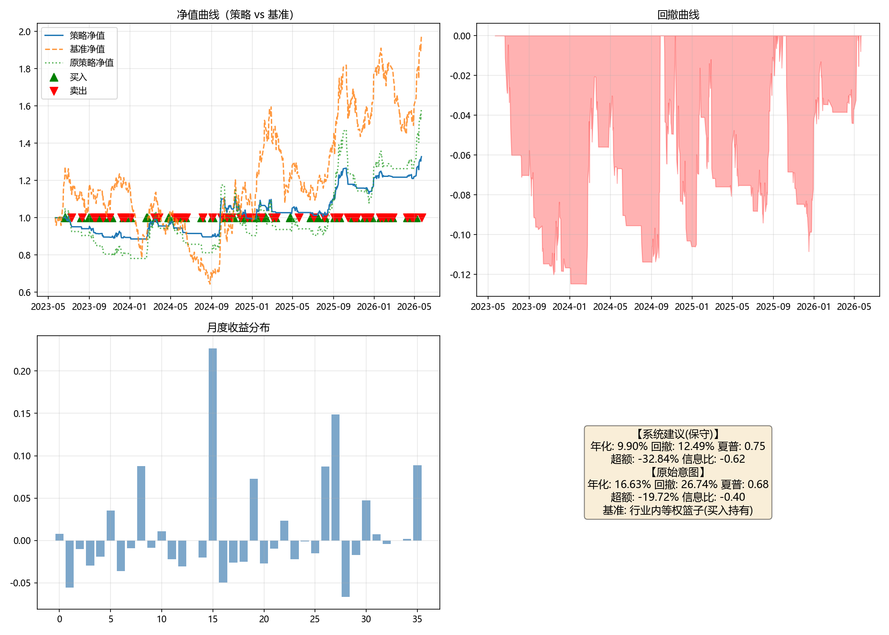

# 投资想法分析报告

## 一、原始想法
> 最近具身智能概念很火，跟着趋势买，涨了就拿跌了就跑。

**投资类型**：自上而下（主题事件驱动）  
**核心逻辑**：跟随具身智能概念热度进行趋势交易，涨持跌卖。

## 二、逻辑链梳理

### 你的投资逻辑
前提层 → 行业层 → 个股层（未指定具体标的，无法分析个股层传导）

### 逻辑链分析

| 层级 | 命题 | 证据 | 缺口 | 替代解释 |
|------|------|------|------|----------|
| 前提 | P1: 最近具身智能概念在A股市场的关注度和热度显著上升。 | 无（B1 evidence 为空） | 缺少近1个月具身智能概念指数涨幅、成交额、换手率及新闻/研报提及频次等数据，无法验证热度是否真实上升。 | 板块表现可能由宏观流动性、政策催化、行业自身景气度或大盘beta驱动，概念热度与板块表现可能只是同期相关而非因果；概念主题交易可能由情绪和资金推动，热度退潮后表现难以持续。 |
| 行业 | I1: 具身智能概念热度上升带动机器人、传感器、AI算法等相关产业链板块表现。 | 无（B1 evidence 为空） | 缺少概念指数与机器人/自动化设备等相关行业指数近1个月相关性及资金流向数据，无法确认热度向产业链传导的强度。 | 相关板块可能受宏观流动性、政策催化或行业自身景气度提升驱动；概念热度上升先于基本面，板块表现可能由情绪与资金推动，热度退潮后表现难以持续。 |
| 个股 | S1: 用户未指定具体个股，无法验证个股层面是否具备与概念热度匹配的基本面或趋势特征。 | 无（verifiable=false） | 未指定具体标的，无法分析个股层传导、订单、份额、产品布局、业绩弹性。 | 无（行业→个股环节无法建立） |

## 三、多维度分析

### 逻辑自洽性
基于 B1 的逐环检验：

**环节一：前提→行业**
- **主张**：具身智能概念热度上升 → 机器人、传感器、AI算法等相关产业链板块表现。
- **传导机制**：概念热度上升通过提高资金关注度与主题交易情绪，吸引增量资金进入相关产业链板块；交易活跃度与估值预期上升，推动机器人、传感器、AI算法等板块指数表现。
- **证据**：无。
- **缺口**：缺少实际数据验证——未提供近1个月具身智能概念指数涨幅、成交额、换手率、新闻/研报提及频次，也未提供概念指数与相关行业指数的相关性及资金流向数据。
- **替代解释**：相关板块表现可能由宏观流动性、政策催化、行业自身景气度提升或大盘beta驱动，概念热度与板块表现可能只是同期相关而非因果；概念主题交易也可能由情绪和资金推动，热度退潮后表现难以持续。

**环节二：行业→个股**
- **主张**：无法建立。
- **传导机制**：无法建立——未指定具体标的，行业层利好向个股层的传导路径（订单、份额、产品布局、业绩弹性）无从分析。
- **证据**：无。
- **缺口**：未指定具体标的，无法分析个股层传导；S1 verifiable=false，无公开数据支撑。
- **替代解释**：无。

**未闭合环节**：
- 前提→行业：缺少实际行情、成交额、资金流向等数据验证。
- 行业→个股：无法验证个股是否受益于行业热度。
- 交易规则层：“涨了就拿跌了就跑”缺少明确的买入触发条件、持有周期、仓位大小及止盈止损参数，规则尚未闭合。

### 时机
基于 B2 的分析：

- **市场状态**：板块级，未指定个股。人形机器人/具身智能板块2026年以来跑输上证指数、沪深300及申万机械设备指数；截至2026-07-10人形机器人指数PE(TTM)31.67倍，近5年历史分位约9%、近一年分位约38%，处于长期底部区域、短期修复后回落。全市场流动性充裕，7月6日至7月10日万得全A日均成交约2.93万亿元，为主题轮动提供土壤；但人形机器人板块上周成交额约7,705.16亿元，环比减少15.25%，占万得全A成交5.26%，显示短期情绪自4月冲高后有所降温。综合看，当前更像“低位震荡+事件驱动”的主题修复状态，而非已确认的持续性上升趋势。
- **估值背景**：截至2026-07-10人形机器人指数PE(TTM)31.67倍，近5年分位约9%、近一年分位约38%；2026-04-17时PE(TTM)33.52倍、近5年分位约10%、近一年分位约62%。长期估值处于历史底部区域，短期情绪修复后有所回落。
- **催化事件**：
  - 2026世界机器人大会（北京亦庄），2026-08-19至08-23，偏多。
  - 第二届世界人形机器人运动会（北京国家速滑馆），2026-08-22至08-26，偏多。
  - 国产人形机器人公司上市安排（宇树、智元、银河通用等），2026下半年起，偏多。
  - 特斯拉机器人产业链催化：产量爬坡、V3版本发布、后续供应商定点确立，2026Q4，偏多。
  - 2026下半年产品交付与商业化验证窗口，中性。
  - 具身智能赛道融资热度延续（2026上半年国内融资超900亿元），偏多。
- **有利条件**：8月事件窗口前后板块成交占比止住回落并放量，指数突破近期平台上沿形成右侧确认；大会落地超预期订单/交付；近5年估值分位低背景下头部公司订单或盈利预期上修；Q4特斯拉催化兑现；需明确持有周期和入场触发。
- **不利条件**：8月事件前高位放量滞涨或成交占比冲高回落；大会后“利好出尽”退潮；下半年商业化验证不及预期；板块持续跑输且无新增催化；无量化止损可能导致反复被震出。
- **信息缺口**：未指定个股无法做个股层趋势/估值判断；未给持有周期，无法评估催化窗口匹配度；未给入场触发/仓位/止损止盈；特斯拉V3等具体日期待核实；融资统计口径差异大。

### 估值
基于 B3 的分析：

- **当前估值数字与口径**：中证机器人指数(H30590) PE-TTM 58.02倍（2026-04-01，界面新闻）、60.07倍（2026-08-18，新浪财经）、95.00倍（2026-08-13，etf.run），口径差异大。万得机器人PE(TTM)分位2020年以来58.66%。
- **历史分位**：近1年分位5.47%（2026-04-01）、12.3%（2026-08-18）；2020/1/2-2026/7/31万得机器人PE(TTM)分位58.66%、PB(LF)57.53%；2025年以来PE 28.80%分位、PB 41.88%分位。
- **行业相对偏离**：机器人板块PE相对AI板块63.69倍折价约50%，相对新能源汽车88倍PE有优势；宇树发行市盈率219.23倍、市销率35.89倍，部分公司未盈利，行业PE可比性弱。
- **绑定thesis的便宜/贵阈值**：本thesis为趋势跟随，估值不是买卖触发器而是风险缓冲。便宜区间：中证机器人指数PE-TTM处于近1年低分位（≤10%-12%，约55-60倍附近）且价格/成交热度未破位。贵/脆弱区间：PE-TTM进入近1年或长期高分位（>80%分位，绝对值约94-95倍以上），或估值快速修复后价格趋势转弱/破位。
- **缺口**：缺乏forward PE/盈利预期；PE口径混乱；无具体个股；机器人公司多亏损或微利，PE失真；无近3年历史分位直接序列。

### 风险收益比
基于 B4 的分析：

- **上行情景**：
  - 概念热度延续：板块指数震荡上行，幅度约+15%~+25%，触发：成交额持续放大、涨停家数维持、龙头不破关键均线、新闻提及频次保持高位。
  - 产业/政策催化：人形机器人量产指引上调、核心零部件订单落地、政策支持，板块进入加速阶段，幅度约+30%~+50%，触发：标杆产品发布/量产节点提前、大额订单或业绩预告超预期、产业政策落地。
- **下行情景**：
  - 主题退潮/情绪降温：板块指数回撤，幅度约-20%~-35%，触发：成交额连续萎缩、龙头炸板/跌停、指数跌破20日/30日线、涨停家数减少。
  - 产业/政策不及预期：产业化进度低于预期、订单/业绩兑现不足，幅度约-25%~-40%，触发：季报/中报低于预期、出货/订单数据疲弱、技术瓶颈未突破、政策降温。
- **非对称性**：上行需要持续情绪或产业催化支撑，下行触发条件兑现更快。板块层面非对称不明显，缺少基本面锚定时下行速度可能快于上行；无具体标的且无量化止损时实际下行风险可能放大。
- **关键风险驱动**（来自 B4 key_risk_drivers，详见第五章“关键风险”）。

### 替代选择
基于 B5 的分析：

- **可比标的（板块子赛道分布）**：
  - 人形机器人整机/本体：直接承载概念，整机技术路线/客户/量产进度差异大。
  - 核心零部件（减速器/伺服/丝杠）：硬件关键环节，叠加国产化逻辑，技术壁垒较高，集中度可能更高。
  - 传感器/机器视觉：感知层，不同技术路线存在替代关系。
  - AI算法/具身大模型：软件与决策层，可移植性较高，可能被硬件厂商内部能力替代。
- **目标定位与可替代性**：目标标的未指定，无法描述独特暴露。板块内各子赛道对概念热度暴露节奏和弹性不同，环节内可替代性差异明显。指定个股后应优先对比其所在环节的技术/客户壁垒，而非泛泛跟随概念热度。
- **缺口**：需指定具体标的才能做替代对比；当前仅基于板块子赛道分布参考。

## 四、综合研判

**被证据支撑的方面**：
- B2 给出板块级可验证市场状态：人形机器人指数PE(TTM)31.67倍、近5年分位约9%，长期估值底部；7月成交额环比减少15.25%、占全A成交5.26%，短期情绪降温——支撑“低位震荡+事件驱动”判断。
- B2 列出可观测偏多催化事件窗口：2026年8月世界机器人大会、人形机器人运动会，及2026下半年国产公司上市、特斯拉V3等，附来源链接。
- B3 提供相对估值锚：机器人板块PE相对AI折价约50%、相对新能源汽车有优势，近1年PE分位5.47%-12.3%与长期分位58.66%形成错位。
- B4 给出带触发信号的上下行情景，风险驱动项均有明确信号。
- B5 将板块内整机、核心零部件、传感器、AI算法子赛道做结构化区分，可作为后续定位参考。

**薄弱方面**：
- 前提→行业：evidence 为空，缺概念指数涨幅/成交额/换手率/资金流向等验证数据；存在宏观流动性/政策/行业自身景气的替代解释。
- 行业→个股：无法建立，未指定具体标的，个股层完全空缺。
- 交易规则层：“涨拿跌跑”未闭合，缺入场触发、持有周期、仓位、止盈止损参数。
- 风险收益比：政策/监管降温为“致命”项，主题资金流出、产业不及预期、流动性收紧为“重大”项。
- 估值信息不足：PE口径混乱（58.02/60.07/95.00倍），缺forward PE，PE失真，无近3年分位直接序列。
- 替代选择信息不足：需指定具体标的才能做替代对比，当前仅板块子赛道分布。

**关键不确定性**：
- 具身智能概念热度是否真实上升，及向产业链传导强度是否被数据证实。
- 板块热点能否从主题情绪/资金推动转为商业验证支撑，热度退潮是否导致快速回落。
- 若后续指定个股，该个股是否处于产业链高壁垒或高弹性环节，业绩能否实际受益。
- 趋势跟随规则是否具备可操作定义，否则“涨拿跌跑”在高波动板块中可能被反复震出。

**成立条件**：若后续出现——具身智能概念指数/人形机器人板块成交额环比止住回落并连续放量，板块指数放量突破近期震荡平台上沿；8月事件窗口出现超预期量产订单、交付数据、复购率或政策支持；中证机器人指数PE-TTM未进入近1年高分位区（≤80%分位，绝对值不持续高于94-95倍）——则“前提→行业”传导获得初步数据验证，板块层趋势跟随逻辑成立。

**证伪条件**：若出现——政策/监管对概念炒作明确降温（交易所风险提示/问询函、异常波动停牌核查、官媒提示风险）；或板块在8月事件窗口高位放量滞涨、成交占比冲高后回落、龙头炸板/跌停；或2026下半年商业化验证窗口头部公司订单、交付、复购率或现金流明显不及预期；或板块在无新增催化下持续跑输上证指数/沪深300/机械设备指数——则“概念热度→板块表现”传导可能被证伪，趋势跟随thesis被推翻。

## 五、关键风险
基于 B4 的 key_risk_drivers，逐项列出：

| 风险因子 | 观测信号 | 严重度 |
|----------|----------|--------|
| 主题热度退潮/资金流出（板块级） | 板块成交额连续萎缩、换手率下降、涨停家数减少、龙头股滞涨或炸板 | 重大 |
| 政策/监管对概念炒作降温（板块级） | 交易所风险提示/问询函、异常波动停牌核查、官媒发声提示风险 | 致命 |
| 产业进度/业绩兑现不及预期（板块级） | 定期报告低于预期、人形机器人订单/出货数据疲弱、核心零部件良率或成本改善缓慢 | 重大 |
| 市场风格切换/流动性收紧（板块级） | 两市成交额萎缩、主力/北向资金净流出成长板块、防御类高股息板块走强 | 重大 |

## 六、参考回测（基于网络经验默认值）

> ⚠️ **回测性质重要说明**：
> - 本章回测结果基于网络检索 / 静态默认补全的行业经验参数，**仅供参考，不构成对想法的验证或否认**。
> - 回测通过 ≠ 想法成立：历史区间表现好，不代表未来有效；样本区间与起止点选择会显著影响结果。
> - 存在过拟合与幸存者偏差风险：参数由默认补全而非针对本想法定制；成分股为当前上市池，未包含已退市个股。
> - 策略相对收益须结合基准解读，单看绝对收益无法区分「策略 alpha」与「市场 beta」。
> - **板块级回测基准机制**：无单一指数对标时，采用 Skill D 指定的 3–5 只代表性个股等权构建篮子作为回测组合与基准参照——若 `data/index_clean.csv` 含匹配的真实指数则以真实指数为基准，否则以上述等权篮子（买入持有）为基准。该篮子为**代表性样本而非全行业成分股**，存在代表偏差，仅近似反映板块走势，不代表板块全部个股表现。

### 策略参数

| 参数 | 取值 | 来源 | 理由 |
|------|------|------|------|
| 标的 | 具身智能/人形机器人板块等权篮子（三花智控、绿的谐波、拓普集团、鸣志电器、汇川技术） | assumption | 板块级回测，用户未指定个股，用行业内真实A股龙头近似暴露 |
| 买入条件 | 组合净值收盘价上穿20日均线（MA20） | web_experience | 基于SuperMind均线交叉示例，趋势跟随型策略常用右侧买入条件（对应“涨了就拿”） |
| 卖出条件 | 组合净值收盘价下穿20日均线（MA20） | web_experience | 基于SuperMind均线死叉示例，趋势反转离场（对应“跌了就跑”） |
| 持有周期 | 最长4个季度（季度调仓，信号每日检查） | assumption | 静态默认值，中期策略默认季度调仓、最长4期；信号检查不受调仓限制 |
| 仓位上限 | 50%（组合占总资金） | assumption | 板块级默认满仓100%，因B4致命风险触发保守模式，仓位减半 |
| 止损 | 组合净值相对入场净值下跌10%时触发 | assumption | 通用默认-15%，因保守模式收紧至-10% |

**参数来源说明**：
- `user`：用户明确指定（无）
- `web_experience`：联网检索的行业经验（SuperMind均线交叉示例）
- `assumption`：模型静态默认值

**网络经验来源**：
- 买入条件/卖出条件：[回测引擎 - SuperMind - 同花顺](https://quant.10jqka.com.cn/view/help/12)

**回测窗口**：2023-05-22 至 2026-05-22
- 对齐方式：generic
- 说明：近3年通用窗口，未对齐想法，锚定行情数据最新日2026-05-22；想法为趋势跟随型且无固定持有周期，禁止使用催化剂前6个月窗口。

**静默保守模式**：已开启。触发原因：B4 key_risk_drivers 中“政策/监管对概念炒作降温” severity: 致命；且 B1 前提→行业 evidence 为空、核心传导未验证；C weakest_aspects 包含该致命项。并在用户未明示仓位/止损/建仓批次参数的基础上自动做保守调整 → 组合仓位50%、止损-10%、建仓批次2（自动化流程，未发起确认）。

**板块级回测标的与基准**：
- **回测组合**：Skill D 指定的以下代表性个股等权篮子（共5只）：三花智控、绿的谐波、拓普集团、鸣志电器、汇川技术。
- **基准**：优先取 `data/index_clean.csv` 中匹配的真实指数；无匹配时以上述等权篮子（买入持有）为基准。本回测运行中未匹配到真实指数，因此基准为**行业内等权篮子（买入持有）**，该篮子为代表性样本，非全行业成分股，存在代表偏差。

### 回测验证

**系统建议（保守模式回测）**：

| 指标 | 数值 |
|------|------|
| 回测区间 | 2023-05-22 至 2026-05-22 |
| 年化收益率 | 9.90% |
| 最大回撤 | 12.49% |
| 夏普比率 | 0.75 |
| 跑赢基准 | -32.84% |
| 基准期间涨跌幅 | +97.7% |
| 市场状态 | 上涨市 |

**原始意图（保守覆盖前参数回测）**：

| 指标 | 数值 |
|------|------|
| 回测区间 | 2023-05-22 至 2026-05-22 |
| 年化收益率 | 16.63% |
| 最大回撤 | 26.74% |
| 夏普比率 | 0.68 |
| 跑赢基准 | -19.72% |
| 基准期间涨跌幅 | +97.7% |
| 市场状态 | 上涨市 |

> 说明：原始意图分支使用 D 的 `original_params`（保守覆盖前的参数，忠实还原用户本意/系统默认非保守值），信号与持有期与保守版一致，仅仓位与风控放开。两分支对比可区分「仓位/风控约束贡献」与「择时能力贡献」。**原始意图分支仅供对比参考，非投资建议。**

### 超额收益归因说明
（触发条件：|保守版跑赢基准| = 32.84% ≥ 20%）

保守版跑输基准 -32.84%，原始意图跑输基准 -19.72%。保守模式拖累 = 保守超额 - 原策略超额 = -32.84% - (-19.72%) = **-13.12个百分点**，表明仓位/风控约束（50%仓位、止损-10%）显著拉低了相对基准的表现，并非想法本身完全失效。基准为满仓买入持有的行业内等权篮子（无交易成本），且该篮子代表性有限；策略在近3年板块大幅上涨（基准+97.7%）的行情中，因均线信号频繁进出（保守130次、原始109次），多次错过上涨段，叠加保守版持仓上限仅50%，进一步压缩了收益。因此，跑输基准的主因是仓位对齐不足与择时信号在单边市中踏空，而非板块选择错误——原始意图仓位100%时超额负值收窄至-19.72%，说明若放开仓位约束，策略表现会更接近基准。

### 回测结果可视化

## 七、总结

### 逻辑是否成立
- **成立条件**：若具身智能概念指数/机器人板块成交额止住回落并连续放量，板块指数放量突破平台上沿；8月世界机器人大会出现超预期量产订单、交付或政策支持；中证机器人指数PE-TTM未进入近1年高分位（≤80%分位，绝对值不持续高于94-95倍），则“概念热度→板块表现”传导获得初步数据验证，板块层趋势跟随逻辑成立。
- **证伪条件**：若政策/监管明确降温（交易所问询、停牌核查、官媒提示）；或8月事件窗口高位放量滞涨、龙头炸板/跌停；或2026下半年商业化验证明显不及预期；或板块在无新增催化下持续跑输大盘，则“概念热度→板块表现”传导被证伪，趋势跟随thesis被推翻。

**当前状态**：未满足成立条件，但尚未被证伪。整体可研判性较低（C overall_confidence: low），需等待后续数据验证。

### 后续观察清单
- [ ] 具身智能概念指数成交额、换手率、资金流向是否出现连续放量回升（验证前提→行业传导）。
- [ ] 8月世界机器人大会/人形机器人运动会期间是否出现超预期量产订单、交付数据、客户复购率或政策支持。
- [ ] 中证机器人指数PE-TTM是否维持在近1年低分位（≤10%-12%）附近，未进入高分位（>80%分位）区。
- [ ] 是否出现政策/监管对概念炒作的降温信号（交易所问询、停牌核查、官媒提示风险）。
- [ ] 补充具体个股标的，并分析其处于产业链哪一环节（整机/零部件/传感器/AI算法），该环节技术/客户壁垒及业绩受益程度。
- [ ] 明确交易规则：入场触发条件、持有周期、仓位大小、止盈止损幅度，使“涨拿跌跑”具备可操作定义。
- [ ] 跟踪特斯拉V3发布、供应商定点及国产人形机器人公司上市安排的具体日期和落地情况。
- [ ] 观察2026下半年商业化验证窗口：头部公司订单、交付、复购率、现金流是否兑现。

---

⚠️ **重要提示**：
1. 本报告由 AI 生成，分析内容基于公开信息和模型推理，不保证完整性和准确性。
2. 标注为 `web_experience` 的参数来自联网检索的行业经验，仅供参考，不构成投资建议。
3. 参考回测结果基于网络经验 / 静态默认参数，结果好坏不构成对想法的确认或否认；**回测通过不等于想法被验证**，存在过拟合、幸存者偏差与样本区间依赖风险。
4. 本报告不构成投资建议。